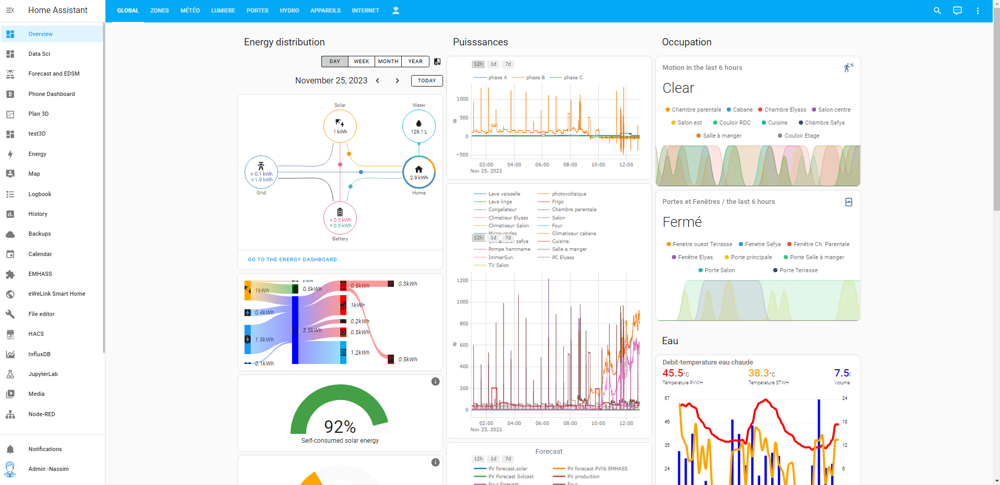
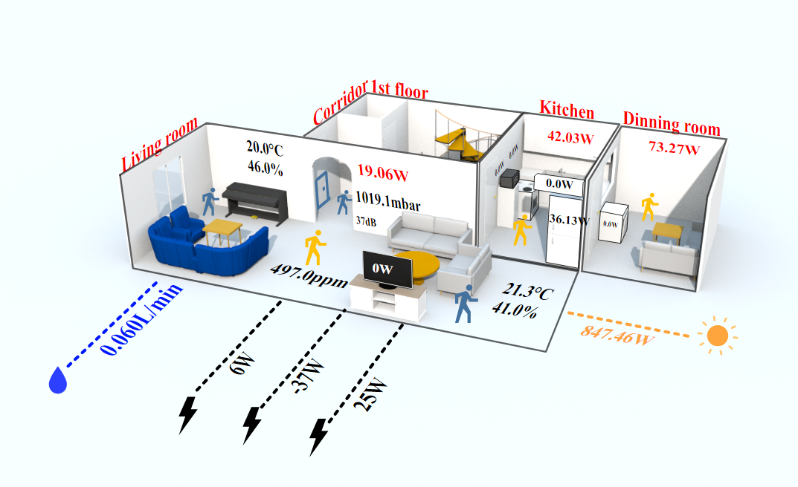

Implementation of a home energy management system (HEMS) through an open-source operating system called Home Assistant, for intelligent energy management as an everyday application scenario of Nassim Autoconsommation. The installation of the HEMS in the Nassim house made it possible to improve comfort, energy efficiency, facilitate everyday tasks and manage safety, lighting, heating and air conditioning systems.

<!--more-->
