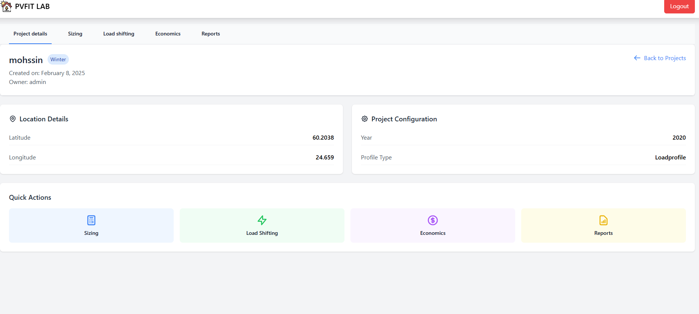
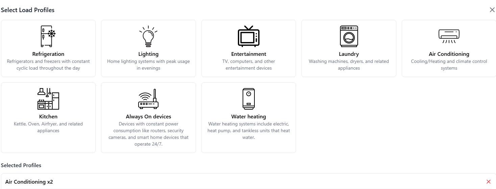

An online tool targeting professionals of the Photovoltaic industry. The aim is to provide an intuitive and comprehensive tool for sizing residential grid-tied PV systems. The webapp includes sizing strategies, load shifting approach, economic assessments and more..

<!--more-->
